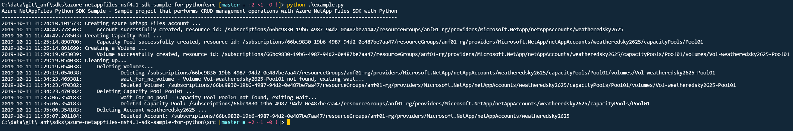

# Azure NetAppFiles NFSv4.1 SDK Sample for Python

This project demonstrates how to deploy a volume enabled with NFS 4.1 protocol using python language and Azure NetApp Files SDK for python.

In this sample application we perform the following operations:

- Creation
  - NetApp Files Account
  - Capacity Pool
  - NFS 4.1 enabled Volume
- Clean up created resources (not enabled by default)

If you don't already have a Microsoft Azure subscription, you can get a FREE trial account [here](http://go.microsoft.com/fwlink/?LinkId=330212).

## Prerequisites

1. Python (code was built and tested under 3.7.3 version)
2. Azure Subscription
3. Subscription needs to be whitelisted for Azure NetApp Files. For more information, please refer to [this](https://docs.microsoft.com/azure/azure-netapp-files/azure-netapp-files-register#waitlist) document.
4. Resource Group created
5. Virtual Network with a delegated subnet to Microsoft.Netapp/volumes resource. For more information, please refer to [Guidelines for Azure NetApp Files network planning](https://docs.microsoft.com/en-us/azure/azure-netapp-files/azure-netapp-files-network-topologies)
6. For this sample Python console application work, we need to authenticate and the method chosen for this sample is using service principals.
   1. Within an [Azure Cloud Shell](https://docs.microsoft.com/en-us/azure/cloud-shell/quickstart) session, make sure you're logged on at the subscription where you want to be associated with the service principal by default:
        ```bash
        az account show
        ```
   
        If this is not the correct subscription, use:
   
        ```bash
        az account set -s <subscription name or id>  
        ```

    2. Create a service principal using Azure CLI
   
        ```bash
        az ad sp create-for-rbac --sdk-auth
        ```
       >Note: this command will automatically assign RBAC contributor role to the service principal at subscription level, you can narrow down the scope to the specific resource group where your tests will create the resources.

    3. Copy the output content and paste it in a file called azureauth.json and secure it with file system permissions
    4. Set an environment variable pointing to the file path you just created, here is an example with Powershell and bash:
            
        Powershell
   
        ```powershell
        [Environment]::SetEnvironmentVariable("AZURE_AUTH_LOCATION", "C:\sdksample\azureauth.json", "User")
        ```
        Bash

        ```bash
        export AZURE_AUTH_LOCATION=/sdksamples/azureauth.json
        ```
        >Note: for other Azure Active Directory authentication methods for Python, please refer to these [samples](https://github.com/AzureAD/microsoft-authentication-library-for-python/tree/dev/sample). 

# What is example.py doing? 

This sample project is dedicated to demonstrate how to deploy a Volume in Azure NetApp Files that uses NFS v4.1 protocol, similar to other examples, the authentication method is based on a service principal, this project will create a single volume with a single capacity pool using standard service level tier and finally an NFS v4.1 Volume.
There is a section in the code dedicated to remove created resources, by default this script will not remove all created resources, this behavior is controlled by a variable called `SHOULD_CLEANUP`, if you want cleanup right after the creation operations, just set it to `True`. For a more advanced python example, please see the first item in the references section of this document.

# Contents

| File/folder                 | Description                                                                                                      |
|-----------------------------|------------------------------------------------------------------------------------------------------------------|
| `media\`                       | Folder that contains screenshots.                                                                                              |
| `src\`                       | Sample source code folder.                                                                                              |
| `src\example.py`            | Sample main file.                                                                                                |
| `src\sample_utils.py`       | Sample file that contains authentication functions, all wait functions and other small functions.                |
| `src\resource_uri_utils.py` | Sample file that contains functions to work with URIs, e.g. get resource name from URI (`get_anf_capacitypool`). |
| `src\requirements.txt`       | Sample script required modules.                                                                                  |
| `.gitignore`                | Define what to ignore at commit time.                                                                            |
| `CHANGELOG.md`              | List of changes to the sample.                                                                                   |
| `CONTRIBUTING.md`           | Guidelines for contributing to the sample.                                                                       |
| `README.md`                 | This README file.                                                                                                |
| `LICENSE`                   | The license for the sample.                                                                                      |
| `CODE_OF_CONDUCT.md`        | Microsoft's Open Source Code of Conduct.                                                                         |

# How to run the script

1. Clone it locally
    ```powershell
    git clone https://github.com/Azure-Samples/azure-netappfiles-nsf4.1-sdk-sample-for-python.git
    ```
1. Change folder to **.\azure-netappfiles-nsf4.1-sdk-sample-for-python\src**
2. Install any missing dependencies as needed
    ```bash
    pip install -r ./requirements.txt
    ```
3. Make sure you have the azureauth.json and its environment variable with the path to it defined (as previously describe in [prerequisites](#Prerequisites))
4. Edit file **example.py** and change the variables contents as appropriate (names are self-explanatory).
5. Run the script
    ```powershell
    python ./example.py
    ```

Sample output


# References

- [Azure NetAppFiles SDK Sample for Python](https://docs.microsoft.com/en-us/samples/azure-samples/netappfiles-python-sdk-sample/azure-netappfiles-sdk-sample-for-python/)
- [Azure Active Directory Python Authentication samples](https://github.com/AzureAD/microsoft-authentication-library-for-python/tree/dev/sample)
- [Resource limits for Azure NetApp Files](https://docs.microsoft.com/en-us/azure/azure-netapp-files/azure-netapp-files-resource-limits)
- [Azure Cloud Shell](https://docs.microsoft.com/en-us/azure/cloud-shell/quickstart)
- [Azure NetApp Files documentation](https://docs.microsoft.com/en-us/azure/azure-netapp-files/)
- [Download Azure SDKs](https://azure.microsoft.com/downloads/) 
 
